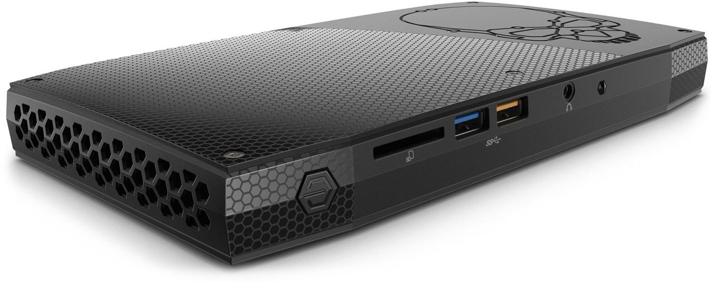

Notes on running a 3-node MapR cluster with Ubuntu 14.04 on Intel NUC6i7KYK (Skull Canyon).

# Hardware

Here is the hardware what I used to setup the NUCs:

## Components
* [Intel NUC NUC6i7KYK Mini PC](https://www.amazon.com/dp/B01DJ9XS52/ref=cm_sw_r_tw_dp_x_nwTTybBZ1M1KH) -
  6th generation Intel® Core™ i7-6770HQ processor with Intel® Iris™ Pro graphics (2.6 to 3.5 GHz Turbo, Quad Core,
  6 MB Cache, 45W TDP). ($570)
* [Crucial MX300 525GB SSD](https://www.amazon.com/dp/B01L80DH4G/ref=cm_sw_r_tw_dp_x_JnTTybYVCEPK8) - 525 GB
 SSD in Micron's MX-series product line. I/O speed advertised as 530 MB/s read and 510 MB/s write. ($150)
* [Crucial 32GB (2x 16GB) SODIMM](https://www.amazon.com/dp/B015YPB8ME/ref=cm_sw_r_tw_dp_x_5gTTybB9J0D10) -  DDR4 SODIMM laptop memory from Micron. DDR4 2400MHz PC4-19200 SODIMM 2Rx8 CL16 1.2v Notebook RAM. ($223)

## Peripherial Components
* USB Keyboard
* 8-port ethernet switch
* Ethernet cables
* Stand-alone monitor with HDMI input
* Mini DisplayPort (Thunderbolt) to HDMI adapter
* HDMI display cable
* 2GB or larger USB stick

# Install Ubuntu 14.04
Download the *Ubuntu 14.04 64-bit PC (AMD64) server install image* from http://releases.ubuntu.com/trusty/, then create a bootable USB stick like this:

    hdiutil convert -format UDRW -o ubuntu-14.04.5-server-amd64.img ubuntu-14.04.5-server-amd64.iso
    diskutil list
    # Then insert the USB stick
    diskutil list
    #Then identify the usb storage device, e.g. /dev/disk3
    diskutil unmountDisk /dev/disk3
    sudo dd if=ubuntu-14.04.5-server-amd64.img.dmg of=/dev/rdisk3 bs=1m
    diskutil eject /dev/disk

Put the usb stick in the NUC and power it up. Go through the Ubuntu installation. 

## Partitions
Create partitions for the Ubuntu operating system, swap space, and an unmounted partition for the MapR filesystem. Here's the partition table shown by running `lsblk -o "NAME,SIZE,FSTYPE,MOUNTPOINT"`
    
    NAME     SIZE FSTYPE MOUNTPOINT
    sda    489.1G
    ├─sda1 139.7G        /
    ├─sda2   9.3G        [SWAP]
    └─sda3   340G

I assigned static IPs to each NUC with a config that looks like this:

## Networking
I used hostnames, "nodea", "nodeb", and "nodec", and assigned them static IPs 192.168.2.4, 192.168.2.5, and 192.168.2.6.

### /etc/network/interfaces

    auto em1
    #iface em1 inet dhcp
    iface em1 inet static
    address 192.168.2.4
    netmask 255.255.255.0
    gateway 192.168.2.1

I'm primarily run these NUCs offline, but when I need them to reach the internet I connect them to my LAN and point them to a nameserver like this:

###/etc/resolv.conf

    nameserver 192.168.0.1

Note, that will only work temporarily. The resolv.conf file will be overwritten when the NUC reboots.

# Install MapR

Download and run the MapR installer like this on nodea:

    wget http://package.mapr.com/releases/installer/mapr-setup.sh -P /tmp
    sudo bash /tmp/mapr-setup.sh

Specify /dev/sda3 as the installation path when prompted.

## Setup NFS automount
On nodeb and nodec, create a mount point for MapR-FS with `sudo mkdir /mapr` and add the following to */etc/fstab*:

    nodea:/mapr   /mapr    nfs    auto    0   0

# Benchmarks

My applications ran a lot faster on these Intel NUCs than I expected. So I ran a few quick-and-dirty benchmarks to compare them with a MapR cluster I'm running in Azure and another I'm running on baremetal in a lab.

## CPU
Running `cat /proc/cpuinfo | grep bogomip`:

* Skull Canyon: 41,472 BogoMIPS
* Azure DS14: 70,393 BogoMIPS
* HP Proliant DL380 G6: 89,600 BogoMIPS

| Device                | BogoMIPS |
|-----------------------|---------:|
| Skull Canyon          | 41,472 |
| HP Proliant DL380 G6  | 89,600 |
| Azure DS14 VM         | 70,393 |

## I/O
Running `hdparm -tT /dev/...`:

| Device                | Drive               | Buffered Reads | Cached Reads    |
|-----------------------|---------------------|----------------|----------------:|
| Skull Canyon          | Crucial MX300 SSD   | 2055 MB/sec    | 13037.37 MB/sec |
| HP Proliant DL380 G6  | HP 15000RPM SATA    |   116 MB/sec   |  9396 MB/sec    |
| Azure DS14 VM         | Premium Storage SSD |  13 MB/sec     |  6191 MB/sec    |

That I/O result is surprising. Even though Azure provides SSD storage with the DS14, they only get spinning-disk level throughput. Combine that with the fact that virtual networks in Azure are generally limited to 1 gig ethernet speeds, makes me much more inclined to use the NUC for cluster computing.

## MapR Stream Benchmark
Running `mapr perfproducer -path /user/mapr/iantest -ntopics 1 -npart 3 -nmsgs 1000000 -msgsz 100`:

| Device                | Messages Sent       | Bytes Sent      | 
|-----------------------|---------------------|----------------:|
| Skull Canyon          | 1,317,756 nMsgs/sec | 172,297 KBs/sec |
| HP Proliant DL380 G6  | 979,695 nMsgs/sec   | 128,096 KBs/sec |
| Azure DS14 VM         | 429,600 nMsgs/sec   | 56,170 KBs/sec  |

Not too shaby! Given that I can buy an Intel i7 NUC for the same amount it costs me to run a DS14 VM in Azure for one month, I'd say these NUCs are pretty cost effective. 

